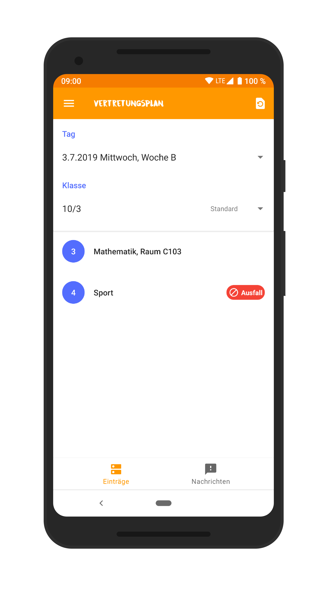
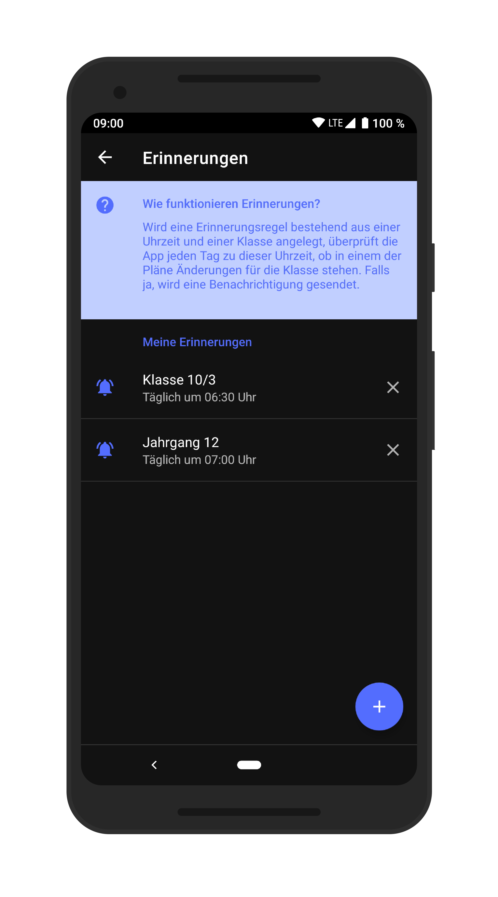

	

## GymNW Vertretungsplan-App

> **Hinweis**: Die Vertretungsplan-App befindet sich nicht mehr in 
> aktiver Entwicklung und steht auch keinen neuen Benutzern mehr über den 
> Google Playstore zur Verfügung.  
> Dieses Repository dient lediglich als Archiv. Die App darf von findigen 
> Entwicklern jedoch nahezu beliebig weitergeführt werden (siehe `LICENSE`).

Dies ist meine inoffizielle App für den Vertretungsplan des Gymnasiums Neu Wulmstorf.  
Sie zeigt die Einträge des Vertretungsplans übersichtlich, ohne komplizierte Abkürzungen sowie nach Tagen bzw. Klassen und Jahrgängen gefiltert an. Eine praktische Erinnerungsfunktion benachrichtigt auf Wunsch über mögliche Ausfälle oder Vertretungsstunden.

### Bitte beachten Sie

Ich entwickele die App unabhängig vom Gymnasium Neu Wulmstorf als Freizeitprojekt neben meinem Studium. Die App bezieht ihre Daten lediglich von der Schulhomepage und wertet diese aus.

**Auch, wenn die App erfahrungsgemäß sehr zuverlässig funktioniert, übernehme ich hierfür keinerlei Garantie. Jegliche Nutzung obliegt also ausdrücklich Ihrer eigenen Verantwortung!**  

Sollten Sie sich einmal unsicher sein, enthält die offizielle Schulhomepage stets die Originaldaten.

### Screenshots

	
	
	
	

